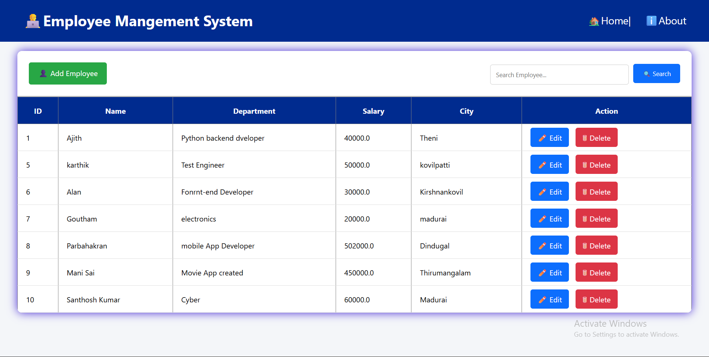
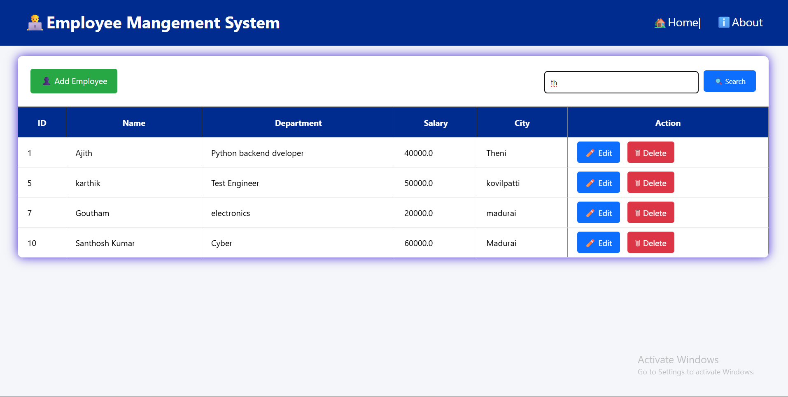
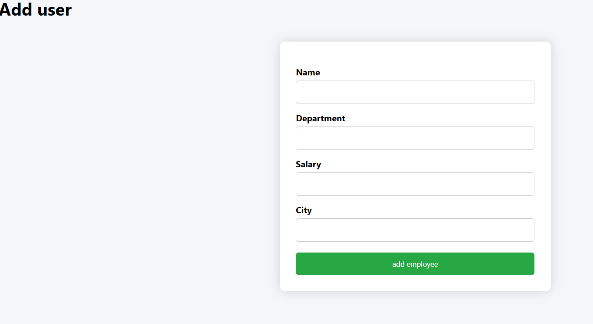
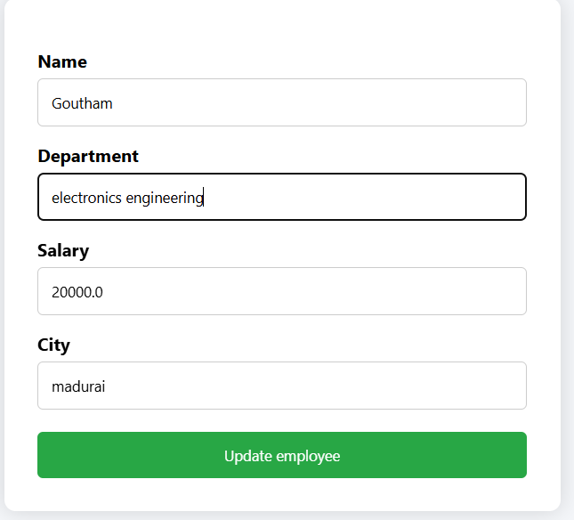
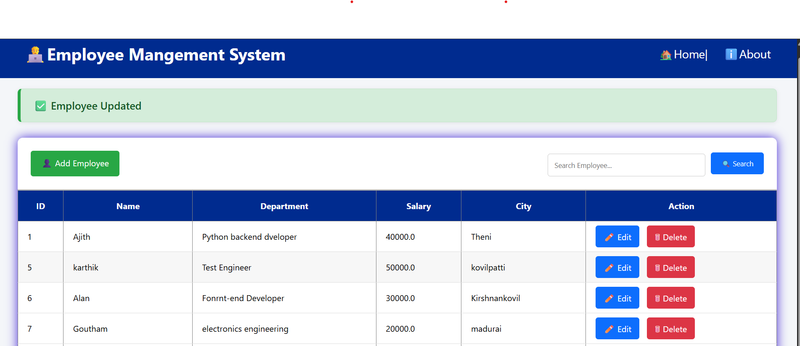
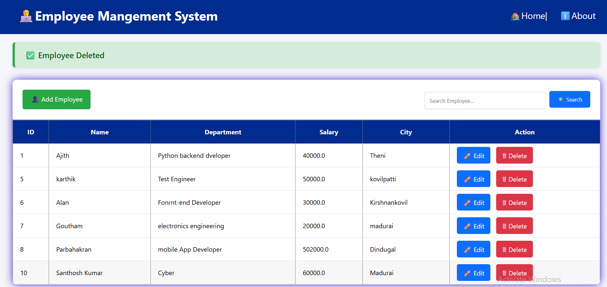

# 👨‍💼 Employee Management System

A modern Employee Management System built using **Python Flask**, **MySQL**, **HTML**, and **CSS**. This application allows users to manage employee records efficiently with CRUD operations and a clean user interface.

---

## 🚀 Features

✅ Add New Employee

✅ View Employee Records

✅ Update Employee Details

✅ Delete Employee Records

✅ Search Employees

✅ Flash Success Messages

✅ Responsive UI Design

✅ MySQL Database Integration

---

## 🛠️ Technologies Used

* Python
* Flask
* MySQL
* HTML5
* CSS3
* Jinja2 Templates

---

## 📂 Project Structure

```text
Employee-Management-System/
│
├── static/
│   └── style.css
│
├── templates/
│   ├── home.html
│   ├── add_employee.html
│   └── update_employee.html
│
├── app.py
├── requirements.txt
└── README.md
```

---

## ⚙️ Installation

### 1️⃣ Clone Repository

```bash
git clone <repository-url>
```

### 2️⃣ Navigate to Project

```bash
cd Employee-Management-System
```

### 3️⃣ Install Dependencies

```bash
pip install flask mysql-connector-python
```

### 4️⃣ Configure MySQL Database

Create a database:

```sql
CREATE DATABASE employee_db;
```

Create table:

```sql
CREATE TABLE employee(
    ID INT PRIMARY KEY AUTO_INCREMENT,
    Name VARCHAR(100),
    Department VARCHAR(100),
    Salary DECIMAL(10,2),
    City VARCHAR(100)
);
```

### 5️⃣ Run Application

```bash
python app.py
```

---

## 📸 Screenshots

### Dashboard


* Search Employee

* Add Employee Button

* Update & Delete Operations



---

## 🎯 Future Enhancements

* Employee Login System
* Authentication & Authorization
* Department Management
* Export to Excel/PDF
* Dashboard Analytics
* REST API Integration

---

## 👨‍💻 Author

**Ajith**

Aspiring Python Backend Developer

GitHub: https://github.com/AJITHRAJA8
